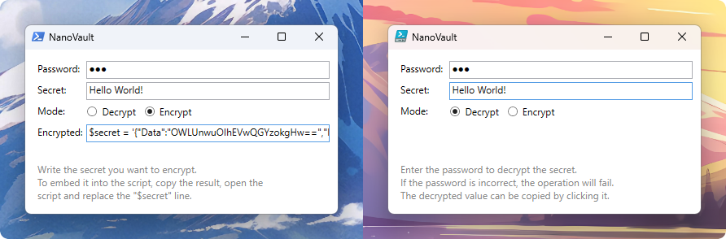

# NanoVault

Minimal and portable vault for Windows.

## What is this?

A single and portable [Powershell](https://learn.microsoft.com/en-us/powershell/scripting/overview?view=powershell-5.1)
script that can **encrypt** any line of text and later **decrypt** it.

## Usage

### Encrypt

1.  Execute the script. This will open a window.
2.  Set mode to encrypt.
3.  Write your password and secret.
4.  Click the encrypted line. It should look like `$secret = '{...}'`
5.  Close the window and open the script in a text editor. You can use notepad.
6.  Find a line starting with `$secret = ''`, then delete it and paste the line
    you've copied in **step 4**.

### Decrypt

1.  Execute the script. This will open a window.
2.  Set the mode to decrypt.
3.  Write a password.
4.  If it is correct, the secret will be revealed.
5.  To copy it, just click the text.

## Thecnical details

-   **Zero dependencies**, so any clean install of windows 10 and 11 can run it out-of-the-box.
-   Compatible with **Powershell** 5.1 and 7.
-   **Encryption/decryption** using AES-256 (CBC) with PBKDF2 key derivation.
    Meaning strong encryption with resistance to brute-force attacks thanks to key stretching, salt, and a random IV.

## Why did I create this script?

I was preparing my [unnatended windows iso](https://learn.microsoft.com/en-us/windows-hardware/customize/desktop/unattend/)
to include my own programs, configurations, personal tweaks, and **secrets**
like wifi passwords.

Because it is stupid to store **sensitive data** in plain text, I decided to
to store this data encrypted inside a script that can decrypt it itself.

## License

It is licensed under the [MIT](LICENSE.md).